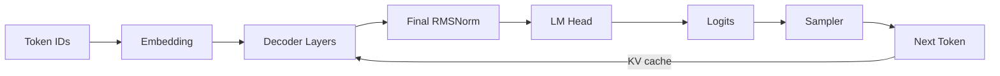

# my-tiny-llm

Build a small Qwen3 inference engine with PyTorch, one tested exercise at a
time.

> [!IMPORTANT]
> This repository is a **practice workspace**, not a completed solution.
> Implementation points contain `TODO` markers and raise
> `NotImplementedError`. Tests define the required behavior without placing a
> solution in the source tree.

## Goal

The original [skyzh/tiny-llm](https://github.com/skyzh/tiny-llm) course uses MLX
on Apple Silicon. This project keeps the learning journey but targets Linux,
PyTorch, CPU, and CUDA.

By the end, you will understand how data moves through a dense decoder-only
language model:



You will implement tensor operations, attention, Qwen3 layers, cached decoding,
sampling, generation, and checkpoint loading. The project should remain free of
MLX runtime imports.

## Repository Layout

```text
my-tiny-llm/
├── README.md
├── pyproject.toml
├── src/
│   └── my_tiny_llm/
│       ├── __init__.py              # Stable public API exports
│       ├── cli.py                   # Command-line wiring
│       ├── core/
│       │   ├── ops.py               # Softmax, linear, SiLU
│       │   └── attention.py         # Masks, SDPA, GQA, MHA
│       ├── layers/
│       │   ├── normalization.py     # RMSNorm
│       │   └── rope.py              # Rotary position embeddings
│       ├── models/
│       │   ├── config.py            # Qwen3 configuration adapter
│       │   └── qwen3.py             # Decoder and causal LM
│       ├── inference/
│       │   ├── sampling.py          # Greedy, temperature, top-k, top-p
│       │   └── generation.py        # Prefill and cached decoding loop
│       └── checkpoints/
│           └── loader.py            # Hugging Face SafeTensors loading
└── tests/
    ├── unit/
    │   ├── test_core.py             # Tensor and attention checks
    │   └── test_sampling.py         # Sampling checks
    └── integration/
        ├── test_qwen3.py            # Transformers and cache equivalence
        └── test_checkpoints.py      # Local SafeTensors round trip
```

### Folder Responsibilities

| Folder | Responsibility | May depend on |
| --- | --- | --- |
| `core` | General tensor and attention operations | PyTorch only |
| `layers` | Reusable neural-network layers | `core`, PyTorch |
| `models` | Qwen3 architecture and cache contracts | `core`, `layers` |
| `inference` | Sampling and autoregressive decoding | `models` |
| `checkpoints` | Configuration, tokenizer, and weight loading | `models`, Hugging Face |
| `cli.py` | User input and runtime device selection | Public package APIs |

Keep dependencies flowing downward through this table. For example, `core`
must not import `models`, and model code must not import the CLI.

## Setup

### Requirements

- Linux
- Python 3.10, 3.11, or 3.12
- CPU, or an NVIDIA GPU with a compatible PyTorch installation
- Git and a shell

### Create the Environment

```bash
cd /home/azhpcuser/my-tiny-llm
python3 -m venv .venv
.venv/bin/python -m pip install --upgrade pip
.venv/bin/python -m pip install -e '.[dev]'
```

Confirm the environment:

```bash
.venv/bin/python -c "import torch; print(torch.__version__)"
.venv/bin/python -c "import torch; print('CUDA:', torch.cuda.is_available())"
.venv/bin/python -m pytest --collect-only -q
```

Use the installer command from
[pytorch.org](https://pytorch.org/get-started/locally/) first if you need a
specific CUDA wheel.

## Practice Rules

1. Implement one exercise at a time.
2. Run the narrowest relevant test after every change.
3. Do not import MLX or `mlx-lm`.
4. Do not use a Transformers model as the implementation.
5. Transformers may be used by tests as an independent behavioral reference.
6. Keep public function signatures and checkpoint parameter names unchanged.
7. Prefer tensor operations over Python loops for model math.
8. Read error shapes carefully before changing code.

Find unfinished work with:

```bash
rg "TODO|Exercise" src
```

## Tensor Conventions

The tests and function signatures use these names consistently:

| Symbol | Meaning |
| --- | --- |
| `B` | Batch size |
| `L` | Query sequence length |
| `S` | Key/value sequence length |
| `Hq` | Number of query heads |
| `Hkv` | Number of key/value heads |
| `D` | Per-head dimension |
| `V` | Vocabulary size |

Important shapes:

| Tensor | Shape |
| --- | --- |
| Token IDs | `[B, L]` |
| Hidden states | `[B, L, hidden_size]` |
| Query | `[B, Hq, L, D]` |
| Key and value | `[B, Hkv, S, D]` |
| Attention scores | `[B, Hq, L, S]` |
| Logits | `[B, L, V]` |
| One layer's cache | `(key, value)` |

Write down the expected shape before each `reshape`, `transpose`, or broadcast.
Most attention bugs are shape bugs.

## Exercise Roadmap

### Stage 1: Tensor Primitives

File: `src/my_tiny_llm/core/ops.py`

| Exercises | Task | Completion signal |
| --- | --- | --- |
| 1 | Numerically stable softmax | Primitive test passes |
| 2 | Linear projection with optional bias | Primitive test passes |
| 3 | SiLU activation | Primitive test passes |

Run:

```bash
.venv/bin/python -m pytest \
  tests/unit/test_core.py::test_tensor_primitives_match_torch -q
```

### Stage 2: Attention

File: `src/my_tiny_llm/core/attention.py`

| Exercises | Task | Key concern |
| --- | --- | --- |
| 4 | Scaled dot-product attention | Scale and additive masks |
| 5 | Causal mask | Different query/key lengths |
| 6 | Grouped-query attention | `Hq` must group over `Hkv` |
| 7-8 | Simple multi-head attention | Projection and head layout |

Run one test at a time:

```bash
.venv/bin/python -m pytest \
  tests/unit/test_core.py::test_simple_attention_matches_torch -q
.venv/bin/python -m pytest \
  tests/unit/test_core.py::test_grouped_causal_attention_matches_expanded_torch_attention -q
.venv/bin/python -m pytest \
  tests/unit/test_core.py::test_simple_multi_head_attention_matches_torch -q
```

### Stage 3: Reusable Layers

Files:

- `src/my_tiny_llm/layers/normalization.py`
- `src/my_tiny_llm/layers/rope.py`

| Exercises | Task | Key concern |
| --- | --- | --- |
| 9-10 | RMSNorm initialization and forward pass | Accumulation dtype |
| 11 | Rotary position embeddings | Position and head dimensions |

These layers are validated through the Qwen3 integration test. During
development, use small tensors and inspect shapes before running the full test.

### Stage 4: Qwen3 Components

File: `src/my_tiny_llm/models/qwen3.py`

| Exercises | Task | Key concern |
| --- | --- | --- |
| 12-13 | Qwen3 grouped-query attention | Q/K norms, RoPE, cache layout |
| 14-15 | Gated MLP | Gate, up, and down projections |
| 16-17 | Decoder layer | Pre-norm residual order |

Keep module attribute names unchanged. The SafeTensors checkpoint loader relies
on names such as `q_proj`, `k_proj`, `gate_proj`, and `input_layernorm`.

### Stage 5: Complete Model and KV Cache

File: `src/my_tiny_llm/models/qwen3.py`

| Exercises | Task | Completion signal |
| --- | --- | --- |
| 18-19 | Embedding, decoder stack, final norm | Hidden states have expected shape |
| 20 | Causal language-model wrapper | Logits match Transformers |
| 21 | Optional tied embeddings | Parameters share storage |
| 22 | Masks, positions, and cache-aware forward | Cached logits match full logits |

Run:

```bash
.venv/bin/python -m pytest \
  tests/integration/test_qwen3.py::test_qwen3_logits_match_transformers -q
.venv/bin/python -m pytest \
  tests/integration/test_qwen3.py::test_kv_cache_matches_full_sequence -q
```

The first test checks a tiny random model. It does not download Qwen weights.

### Stage 6: Sampling and Generation

Files:

- `src/my_tiny_llm/inference/sampling.py`
- `src/my_tiny_llm/inference/generation.py`

| Exercises | Task | Key concern |
| --- | --- | --- |
| 23 | Greedy, temperature, top-k, and top-p sampling | Filtering order and probabilities |
| 24 | Autoregressive generation | Prefill once, decode with cache, stop at EOS |

Run:

```bash
.venv/bin/python -m pytest tests/unit/test_sampling.py -q
```

### Stage 7: Checkpoint Loading

File: `src/my_tiny_llm/checkpoints/loader.py`

| Exercises | Task | Key concern |
| --- | --- | --- |
| 25 | Discover SafeTensors files | Single and sharded checkpoints |
| 26 | Construct and populate the model | Missing keys, device, and dtype |

Run:

```bash
.venv/bin/python -m pytest tests/integration/test_checkpoints.py -q
```

The test creates a temporary local checkpoint. It does not download a real
model.

## Recommended Development Loop

For every exercise:

```text
1. Read the function signature and docstring.
2. Write expected input and output shapes on paper.
3. Implement the smallest version that handles the tested behavior.
4. Run one targeted test.
5. Read the first failing assertion only.
6. Fix the root cause, then rerun the same test.
7. Run the entire test file.
8. Run Ruff before moving to the next stage.
```

Useful commands:

```bash
# Show all exercises
rg "TODO|Exercise" src

# Run fast unit tests
.venv/bin/python -m pytest tests/unit -q

# Run model-level integration tests
.venv/bin/python -m pytest tests/integration -q

# Run everything after all exercises are complete
.venv/bin/python -m pytest -q

# Check style
.venv/bin/ruff check .

# Show detailed tensor assertion differences
.venv/bin/python -m pytest <test-path> -vv
```

## Final Run

Only attempt a real checkpoint after all tests pass:

```bash
.venv/bin/my-tiny-llm \
  --model qwen3-0.6b \
  --prompt "Explain grouped-query attention briefly." \
  --max-new-tokens 128
```

Runtime options:

| Option | Purpose |
| --- | --- |
| `--device auto` | Use CUDA when available, otherwise CPU |
| `--temperature 0` | Greedy decoding |
| `--temperature 0.7` | Enable stochastic sampling |
| `--top-k 50` | Keep only the highest-scoring token candidates |
| `--top-p 0.9` | Keep a probability-mass nucleus |
| `--local-files-only` | Refuse network downloads |
| `--enable-thinking` | Request the Qwen3 thinking chat template |

The first non-local run downloads a standard checkpoint such as
`Qwen/Qwen3-0.6B`. Do not use an `-MLX-4bit` checkpoint.

## Definition of Done

Your conversion is complete when all of the following are true:

- `rg "TODO" src` returns no implementation TODOs.
- `rg "^(from|import) (mlx|mlx_lm)" src` returns no matches.
- Unit tests pass.
- Integration tests pass.
- Ruff reports no errors.
- Cached and full-sequence logits agree.
- A standard Qwen3 checkpoint loads.
- The CLI generates text on CPU or CUDA.

## Scope

This practice project covers dense Qwen3 inference and a basic KV cache. It does
not currently cover custom CUDA kernels, paged attention, continuous batching,
speculative decoding, quantized matrix multiplication, or mixture-of-experts
models. Those are suitable follow-up projects after the dense path works.